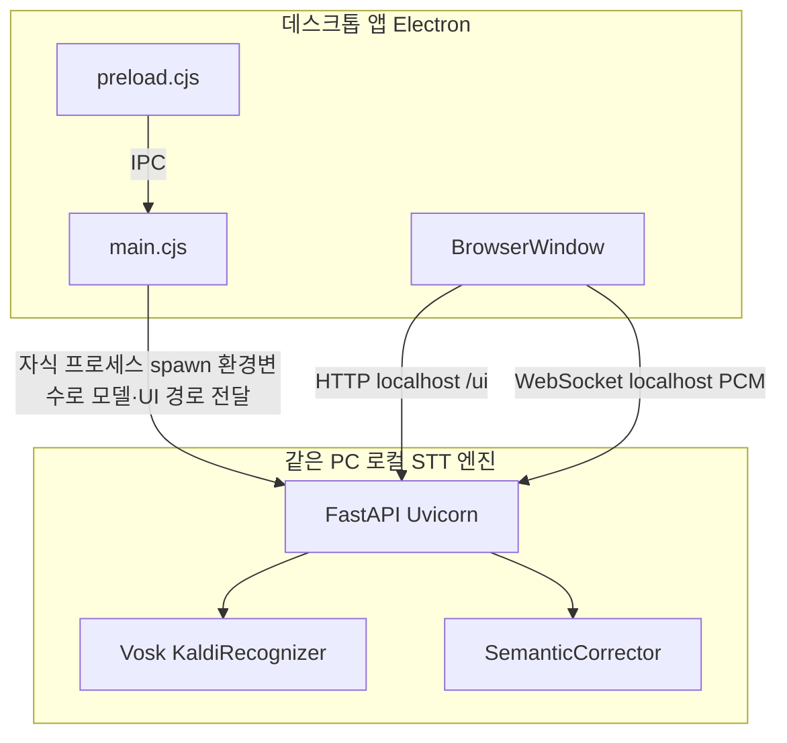

# 실시간 STT — 한국어 음성 인식 **데스크톱 앱**

이 저장소의 **제품 형태는 데스크톱 애플리케이션**입니다. 사용자 PC 안에서만 동작하며, **원격 서버나 클라우드 STT API에 의존하지 않습니다.**

구현상 **Electron**이 창·마이크·파일 저장 등 UI를 담당하고, **같은 PC에서만** 떠 있는 **로컬 STT 엔진 프로세스**(Python + FastAPI + Vosk)가 음성을 받아 처리합니다. 둘은 `127.0.0.1`로만 통신합니다.

마이크 오디오는 **WebSocket**으로 스트리밍하고, **PCM 16 kHz 모노** 기준으로 인식합니다. 확정 구간에는 **의미 교정(어휘 기반)** 파이프라인을 거친 뒤 앱 화면으로 돌려줍니다.

---

## 요약

| 항목 | 설명 |
|------|------|
| **형태** | **Windows/macOS 데스크톱 앱** (설치형·포터블 등 빌드 산출) |
| **역할** | 실시간 한국어 STT + 세션(대화) 목록 + 로그 저장 |
| **UI** | Electron(Chromium) — 화면은 `electron/renderer`, 내용은 로컬 엔진이 `/ui`로 제공 |
| **STT 엔진** | Vosk (`KaldiRecognizer`) + 한국어 모델(경로 자동 탐색 또는 `VOSK_MODEL_PATH`) |
| **후처리** | `stt_corrector.SemanticCorrector` — 정규화, 자모 TF-IDF, 어휘 코사인 유사도 교정 |
| **패키징** | PyInstaller로 STT 실행 파일 번들 + electron-builder로 앱 설치본 — 선택적으로 Electron Forge |

---

## 활용 기술

| 구분 | 기술 |
|------|------|
| **데스크톱 셸** | [Electron](https://www.electronjs.org/) **41.2.0** (Chromium + Node) |
| **메인 프로세스** | `electron/main.cjs` — 창, 자식 프로세스 기동, IPC, 마이크 권한(`session`) |
| **Preload** | `contextBridge` → `window.stt` (저장 대화상자, 종료 IPC) |
| **로컬 STT 엔진** | Python **3.x**, **FastAPI**, **Uvicorn** — **본 PC 전용**, 외부 네트워크로 음성을 보내지 않음 |
| **인식** | **Vosk** (`vosk.KaldiRecognizer`) |
| **앱 내부 통신** | **WebSocket** (`/ws/stt`) — PCM 바이너리 / JSON(partial·final) |
| **UI 정적 파일** | FastAPI `StaticFiles` — `UI_DIR`은 Electron이 로컬 경로로 주입 |
| **번들** | **PyInstaller** (`stt-server.spec` → `dist/stt-server/`) |
| **앱 설치본** | **electron-builder** — NSIS, Portable 등 ([`package.json`](package.json) `build`) |
| **대안 빌드** | **Electron Forge** ([`forge.config.js`](forge.config.js)) |

`stt_corrector.py`는 **Python 표준 라이브러리만** 사용합니다.

---

## 프로젝트 구조

소스·설정 중심입니다 (`node_modules`, 빌드 산출물 제외).

```text
.
├── main.py                    # 로컬 STT 엔진: /health, /ui, /ws/stt, /api/vocabulary
├── stt_corrector.py           # 정규화 · 자모 TF-IDF · 의미 교정
├── requirements.txt           # STT 엔진용 Python 패키지
├── stt-server.spec            # PyInstaller → dist/stt-server/ (앱에 동봉되는 실행 파일)
├── vocabulary.json            # (선택) 개발 시 — 패키지 앱은 userData 경로 사용 가능
├── electron/
│   ├── main.cjs               # 데스크톱: 창, 로컬 엔진 프로세스 spawn, IPC, 리소스 경로
│   ├── preload.cjs
│   └── renderer/
│       ├── index.html
│       └── app.js             # 마이크, WebSocket, 세션, 하단 네비
├── forge.config.js
├── package.json
├── vosk-model-small-ko-0.22/  # Vosk 한국어 모델(압축 해제본)
├── dist/stt-server/           # PyInstaller 산출 (앱 빌드 전에 생성)
└── dist-electron/             # electron-builder 산출
```

---

## 아키텍처 (데스크톱 앱)

### 구성도



### 런타임 흐름

1. 사용자가 **데스크톱 앱**을 실행하면 Electron이 메뉴를 숨기고, **로컬 STT 엔진**을 자식 프로세스로 띄웁니다(개발: `uvicorn`, 배포: PyInstaller `stt-server.exe`).
2. **`http://127.0.0.1:<PORT>/health`** 가 준비될 때까지 기다린 뒤, **같은 머신 안의** 브라우저 창에서 UI를 연다.
3. **앱 창**에서 마이크 캡처 → 필요 시 리샘플 → **PCM**을 WebSocket으로 **로컬 엔진**에만 보낸다.
4. 엔진이 Vosk로 처리한다.
   - **partial**: 실시간 미리보기.
   - **final**: 교정 파이프라인 후 `text`, `original`, `corrections` 등으로 응답.
5. **어휘**는 `/api/vocabulary`로 관리하며, 패키지 앱에서는 **`VOCAB_PATH`** 가 사용자 데이터 폴더를 가리키도록 설정된다.

**즉, “서버를 켜 두는 제품”이 아니라 “앱을 실행하면 그 안에서만 STT가 돌아가는 구조”입니다.**

### 패키지 앱에 동봉되는 리소스 (electron-builder)

[`package.json`](package.json) `build.extraResources` 기준:

| `from` | `to` (앱 `resources/` 안) |
|--------|---------------------------|
| `electron/renderer` | `renderer` |
| `dist/stt-server` | `stt-server` |
| `vosk-model-small-ko-0.22/...` | `vosk-model-small-ko-0.22` |

[`electron/main.cjs`](electron/main.cjs)의 `resolveResource()`는 portable 등에서 `process.resourcesPath`와 실행 파일 옆 `resources/`를 모두 찾습니다.

---

## 주요 스크립트

| 명령 | 설명 |
|------|------|
| `pip install -r requirements.txt` | 로컬 STT 엔진에 필요한 Python 패키지 |
| `npm install` | Electron 및 빌드 도구 |
| `npm run electron:dev` | 개발: Electron이 **로컬 엔진**을 띄운 뒤 앱 창 로드 |
| `npm run build:py` | PyInstaller → `dist/stt-server/` (앱에 넣을 엔진 빌드) |
| `npm run electron:build` | **데스크톱 앱** 설치/포터블 등 |
| `npm run dist` | 엔진 빌드 후 앱 빌드 |
| `npm run start` / `package` / `make` | Electron Forge ([`forge.config.js`](forge.config.js)) |

한국어 Vosk 모델은 저장소 내 경로에 풀려 있어야 하며, 필요 시 **`VOSK_MODEL_PATH`** 로 지정합니다.

---

## WebSocket 페이로드 요약

- **partial**: 실시간 미리보기 (`partial` 필드).
- **final**: 확정 문장 — `text`, `original`, `corrections` 등.

`electron/renderer/app.js`가 이 형식으로 화면을 갱신합니다.

---

## 설치본 실행 오류 (SETUP 후 “STT 시작 실패”)

앱은 먼저 **로컬 STT 엔진**이 `http://127.0.0.1:<포트>/health` 로 응답할 때까지 기다립니다. 여기서 막히면 설치는 됐어도 창이 뜨지 않거나 오류 상자가 납니다.

1. **반드시 `npm run dist` (또는 `build:py` → `electron:build`)** 로 만든 설치 파일을 쓰세요. `electron:build`만 하면 `dist/stt-server/`가 비어 **엔진 exe가 설치본에 없을** 수 있습니다.
2. 설치된 앱의 로그: **`%APPDATA%\<앱 이름>\logs\stt-server.log`** (Electron `app.getPath("logs")`). 엔진이 왜 죽었는지 Python 트레이스가 남습니다.
3. 최신 코드는 설치 직후 **exe·모델·UI 폴더 존재 여부**를 먼저 검사해, 빌드 누락이면 더 구체적인 메시지를 보여 줍니다.

---

## 참고

- **Electron Forge** [`forge.config.js`](forge.config.js) 주석과 실제 리소스 폴더명이 다를 수 있습니다. 기준은 [`electron/main.cjs`](electron/main.cjs)와 electron-builder `extraResources`의 `to`입니다.
- **`async-exit-hook`** 은 [`package.json`](package.json)에 명시해 두었습니다.
- Windows에서 `npm install` 시 **Electron이 실행 중이면** 파일 잠금(EBUSY)으로 실패할 수 있으니 앱을 종료한 뒤 다시 시도하세요.

---

## 라이선스 / 저작권

[`package.json`](package.json)의 `build.copyright` 등을 참고하세요. Vosk 모델 및 서드파티는 각 배포본의 라이선스를 따릅니다.
